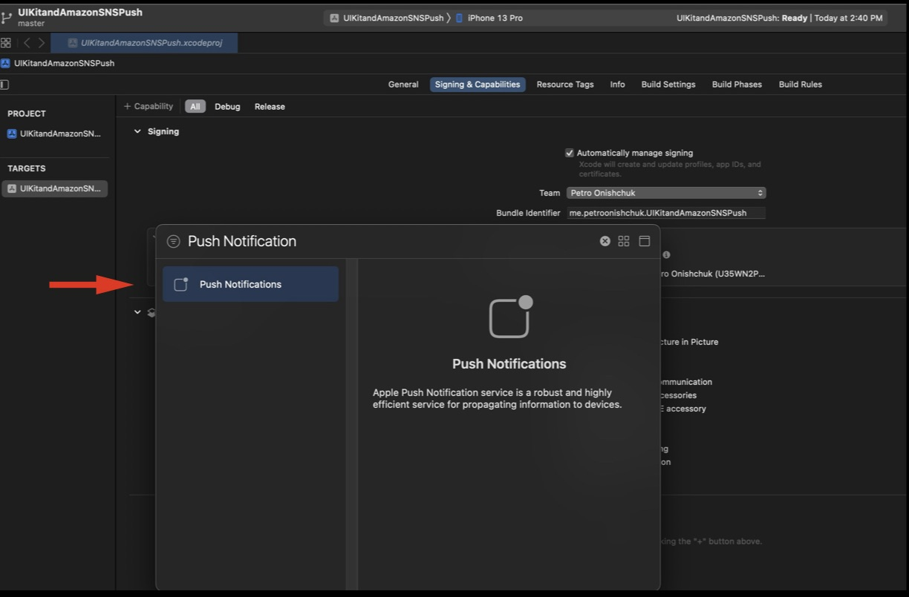
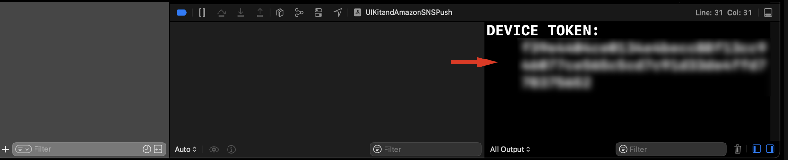

# UIKit Project & Amazon Simple Notification Service
## Push Notifications

## [Apple Developer](https://developer.apple.com)
## [AWS](https://aws.amazon.com)

## 1. Setup Xcode Project. 
### 1.1 Start new Xcode Project (my is UIKitandAmazonSNSPush).

### 1.2. Add capability (Background modes Push Notification).  
  
   
    
      
       
 ### 1.3. Fill our project  
 Create MessageModel.swift.  
 
 Code:  
 
 ```Swift
 //
//  MessageModel.swift
//  UIKitandAmazonSNSPush
//
//  Created by Petro Onishchuk on 8/8/22.
//

import Foundation 

struct Message: Identifiable, Hashable {
    var id: UUID
    var title: String
    var description: String
    var massageDate: Date
}

enum  NotificationNameValue: String {
    case pushNotification = "pushNotification"
}
 ```
 
 ### 1.4. Create AppDelegate.swift file, for setup and work with UNUserNotificationCenter.  
 Also, in AppDelegate.swift we have func, for work Device Token. Don't forget!!!
 
 #### 1.4.1. With class AppDelegate: add  UNUserNotificationCenterDelegate 
 
 ```Swift
 class AppDelegate: UIResponder, UIApplicationDelegate, UNUserNotificationCenterDelegate { ... }
 ```  
 
 #### 1.4.2. Inside: 
 ```Swift
     func application(_ application: UIApplication, didFinishLaunchingWithOptions launchOptions: [UIApplication.LaunchOptionsKey: Any]?) -> Bool {}
 ```
 
 Code: 
 ```Swift
     func application(_ application: UIApplication, didFinishLaunchingWithOptions launchOptions: [UIApplication.LaunchOptionsKey: Any]?) -> Bool {
        // Override point for customization after application launch.
        //MARK: Setup UNUserNotificationCenter
        UNUserNotificationCenter.current().requestAuthorization(options: [.badge, .sound, .alert]) { granted, error in
            guard granted else {
                print("Don't have Notifications")
                return
            }
            DispatchQueue.main.async {
                application.registerForRemoteNotifications()
            }
        }
        // Show when app is running
        let center = UNUserNotificationCenter.current()
        center.delegate = self
        
        return true
    }
     
 ```  
 
 #### 1.4.3. And also inside class AppDelegate add:  
 
 Code: 
 ```Swift
         //MARK: Work with NotificationCenter
    //MARK: Take our Notification
    // take our Notifications
    func userNotificationCenter(_ center: UNUserNotificationCenter, willPresent notification: UNNotification) async -> UNNotificationPresentationOptions {
        
        // This constant hold notifications data
        let userInfo = notification.request.content.userInfo
        
        // POST our Notification data
        // through NotificationCenter
        
        let notificationName = Notification.Name(rawValue: NotificationNameValue.pushNotification.rawValue)
        NotificationCenter.default.post(name: notificationName, object: userInfo)
        
        
        //MARK: Display notification
        //For Display notifications in App
        if UIApplication.shared.applicationState == .active {
            return UNNotificationPresentationOptions.init(arrayLiteral: [.badge, .banner, .sound])
        } else {
            return UNNotificationPresentationOptions.init(arrayLiteral: [.badge, .banner, .sound])
        }
    }
    
    
    //MARK: Device Token
    // Take unique Toke for each physical device.
    // Need for setup Amazon Simple Notification Service
    func application(_ application: UIApplication, didRegisterForRemoteNotificationsWithDeviceToken deviceToken: Data) {
        let token = deviceToken.reduce("") { partialResult, uintNum in
            partialResult + String(format: "%02x", uintNum)
        }
        
        print("DEVICE TOKEN: \(token)\n")
    }
    
    //MARK: Work with Error
    func application(_ application: UIApplication, didFailToRegisterForRemoteNotificationsWithError error: Error) {
        print("Remote Notification Error Description: \(error.localizedDescription)")
    }
    
    
    
 ```
 
 ### 1.5 Inside class SceneDelegate, setup rootViewController:  
 
 Code: 
 ```Swift
 //
//  SceneDelegate.swift
//  UIKitandAmazonSNSPush
//
//  Created by Petro Onishchuk on 8/8/22.
//

import UIKit

class SceneDelegate: UIResponder, UIWindowSceneDelegate {

    var window: UIWindow?


    func scene(_ scene: UIScene, willConnectTo session: UISceneSession, options connectionOptions: UIScene.ConnectionOptions) {
        // Use this method to optionally configure and attach the UIWindow `window` to the provided UIWindowScene `scene`.
        // If using a storyboard, the `window` property will automatically be initialized and attached to the scene.
        // This delegate does not imply the connecting scene or session are new (see `application:configurationForConnectingSceneSession` instead).
        guard let windowsScene = (scene as? UIWindowScene) else { return }
        
        window = UIWindow(windowScene: windowsScene)
        window?.makeKeyAndVisible()
        
        let rootVC = MainViewController()
        let mainNC = UINavigationController(rootViewController: rootVC)
        window?.rootViewController = mainNC
    }

 ```
 
 ### 1.6. Inside MainViewController, add a property for work with all messages and UITableView.  
 
 Code:  
 ```Swift
 //
//  MainViewController.swift
//  UIKitandAmazonSNSPush
//
//  Created by Petro Onishchuk on 8/8/22.
//

import UIKit

class MainViewController: UIViewController {
    var messagesTableView: UITableView!
    var allMessages: [Message] = []
    
    override func viewDidLoad() {
        super.viewDidLoad()
        }
 ```
 
 ### 1.7. Create an extension of MainViewController for setting up UITable View.  
 
 Code:  
 ```Swift
 //
//  SetupTableViewExtension.swift
//  UIKitandAmazonSNSPush
//
//  Created by Petro Onishchuk on 8/8/22.
//
 
import UIKit

extension MainViewController: UITableViewDelegate, UITableViewDataSource {
    
    //MARK: setupMessageTableView()
    //setup constraints for messageTableView
    func setupMessagesTableView() {
        messagesTableView = UITableView()
        messagesTableView.dataSource = self
        messagesTableView.delegate = self
        messagesTableView.register(UITableViewCell.self, forCellReuseIdentifier: "messageCell")
        messagesTableView.translatesAutoresizingMaskIntoConstraints = false
        view.addSubview(messagesTableView)
        messagesTableView.centerXAnchor.constraint(equalTo: view.centerXAnchor).isActive = true
        messagesTableView.centerYAnchor.constraint(equalTo: view.centerYAnchor).isActive = true
        messagesTableView.heightAnchor.constraint(equalTo: view.heightAnchor).isActive = true
        messagesTableView.widthAnchor.constraint(equalTo: view.widthAnchor).isActive = true
    }
    
    
    //MARK: Implemented  UITableViewDelegate, UITableViewDataSource
    func tableView(_ tableView: UITableView, numberOfRowsInSection section: Int) -> Int {
        return allMessages.count
    }
    
    
    func tableView(_ tableView: UITableView, cellForRowAt indexPath: IndexPath) -> UITableViewCell {
        let cell = messagesTableView.dequeueReusableCell(withIdentifier: "messageCell", for: indexPath)
        
        let message = allMessages[indexPath.row]
        
        
        var content = cell.defaultContentConfiguration()
        content.text = message.title
        
        let largeTitle = UIImage.SymbolConfiguration(textStyle: .largeTitle)
        content.image = UIImage(systemName: "envelope.fill", withConfiguration: largeTitle)
        content.secondaryText = "Info: \(message.description).\nSenderID: \(convertDate(date: message.massageDate))"
        content.imageProperties.tintColor = .red
        cell.contentConfiguration = content
        
        return cell
    }
}
 
 ``` 
 
 ### 1.7. Create an extension of MainViewController for setup Notifications.  
 
 Code: 
 ```Swift
 //
//  NotificationExtensionMVC.swift
//  UIKitandAmazonSNSPush
//
//  Created by Petro Onishchuk on 8/8/22.
//

import Foundation
import UIKit

extension MainViewController {
    
    //MARK: Take Notifications
    // Take notifications from NotificationCenter
    func setupNotifications() {
        let notificationName = Notification.Name(NotificationNameValue.pushNotification.rawValue)
        
        //start to listening our notification
        // from NotificationCenter
        NotificationCenter.default.addObserver(forName: notificationName, object: nil, queue: .main) { [weak self] notification in
            
            self?.convertNotificationMessage(userInfo: notification.object)
            
        }
    }
    
    //MARK: Convert message for display in App
    func convertNotificationMessage(userInfo: Any?) {
        
        // Work with Data through NSDictionary
        guard let aps = userInfo as? NSDictionary else {
            print("Convert to NSDictionary Error")
            return
        }
        
        guard let alertMessage = aps.value(forKey: "aps") as? [String: String] else {
            print("Take aps value error")
            return
        }
        let alert = alertMessage["alert"] ?? "No alert value"
        let description = alertMessage["description"] ?? "No description value"
        
        let newMessage = Message(id: UUID(), title: alert, description: description, massageDate: Date())
        print("New Message \(newMessage)")
        DispatchQueue.main.async {
            [weak self] in
            self?.allMessages.append(newMessage)
            self?.messagesTableView.reloadData()
        }
    }
    
   
    
    func convertDate(date: Date) -> String {
        return itemFormatter.string(from: date)
    }
}
 
 ```  
 
 ### 1.8. Fill out our MainViewController. For setup: setupMessagesTableView, setupNotifications, addBarButtonItem.  
 
 Code:  
 ```Swift
 //
//  MainViewController.swift
//  UIKitandAmazonSNSPush
//
//  Created by Petro Onishchuk on 8/8/22.
//

import UIKit

class MainViewController: UIViewController {
    var messagesTableView: UITableView!
    var allMessages: [Message] = []
    
    override func viewDidLoad() {
        super.viewDidLoad()

        // Do any additional setup after loading the view.
        title = "UIKit & AWS SNS"
        setupMessagesTableView()
        setupNotifications()
        addBarButtonItem()
    }
    

     //MARK: AddBarButtonItem()
    func addBarButtonItem() {
        navigationItem.rightBarButtonItem = UIBarButtonItem(barButtonSystemItem: .trash, target: self, action: #selector(cleanMessagesList))
    }
    @objc func cleanMessagesList() {
        DispatchQueue.main.async { [weak self] in
            self?.allMessages = []
            self?.messagesTableView.reloadData()
        }
    }
    
    //Work with Date
    let itemFormatter: DateFormatter = {
        let formatter = DateFormatter()
        formatter.dateStyle = .short
        formatter.timeStyle = .medium
        return formatter
    }()
    

}

 ``` 
## 2. Setup Apple Developer Account 
### 2.1. In Section: Certificates, Identifiers & Profiles, select Keys. We will be creating a key for work with Push Notification.  
### Tap +.  
 
  
 ### 2.2. Select: Apple Push Notifications service (APNs)  
 Tap: Continue.  
  
    
### 2.3. Tap: Register.
   
     
### 2.4. We have Key ID and then Download Your Key.  
   
   
### 2.5. This our Key: AmazonSNS.  
   
     
### 2.6. In section Membership we have Team ID. 
   
     
## 3. Setup Amazon Amazon Simple Notification Service. 

### 3.1. (Create account, if you don't have)
### 3.2. In All services select Simple Notification Service.  
   
     
### 3.3. Select: Push Notifications.  
     
  
### You can see we now have a "platform application, which I created with SwiftUIandAmazonSNSPush project.
### [SwiftUIandAmazonSNSPush Project](https://github.com/PetroOnishchuk/The-SwiftUI-Tutorials/tree/master/AmazonSNSandPushNotification01/SwiftUIandAmazonSNSPush)  
### 3.4. Select: Create platform application.  
   
     
### 3.5. Fill section with red arrow.
In section: Choose file (Must take file, that downloaded from Apple Developer Account).
File:  
    
    
### Amazon SNS section for fill:
   
    
### Part 2:  
   
   
### Signing key ID: From Apple Developer Account == Key ID.    
    
    
### Team ID: From Apple Developer Account.
In section Membership we have Team ID. 
    
    
### 3.6.  Tap: Create platform application.  
   
    
### 3.7. If all success, Select: Create application endpoint. 
   
    
### 3.8. Need to run our Xcode Project on the Real Device, and after your give permission for Notification, you must see on the Output DEVICE TOKEN:
(if you don't have it after the first time, reload App).  
   
     
### 3.9. Put DEVICE TOKEN Number in the field Device token on Amazon SMS and press "Create application endpoint"
   
     
### 3.10. If all success, Select: Publish message. 
   
     
### 3.11. You can send Default (Identical payload for all delivery protocols) and change only text Alert. I select a Custom payload for each delivery protocol. And change the message. And Tap "Publish message" to send our message. 
   
   
### 3.13. If all success, we can send a new message.  
   
    
### 3.14. After sending a couple of messages, I have seen all messages on the screen.  
   
